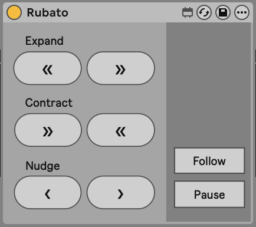

# Rubato

A MIDI controller for Ableton Live built with an [Adafruit MacroPad RP2040](https://www.adafruit.com/product/5128) and a companion Max for Live device.

Designed as a practice and transcription tool, with cue-point-based loop navigation for working through sections of a track.



## What it does

Rubato adds cue-point-based loop navigation to Ableton Live. Drop cue points on a track, loop between them, and work through sections at whatever speed you need. Progressively learn parts a section at a time, then stitch them together to practice the transitions.

### Pad layout (3x4 grid)

```
┌────────────────┬────────────────┬────────────────┐
│ Previous Cue   │ Next Cue       │ Add Cue        │
├────────────────┼────────────────┼────────────────┤
│ Expand Left    │ Expand Right   │ Loop           │
├────────────────┼────────────────┼────────────────┤
│ Contract Left  │ Contract Right │ Follow         │
├────────────────┼────────────────┼────────────────┤
│ Nudge Left     │ Nudge Right    │ Pause/Play     │
└────────────────┴────────────────┴────────────────┘
```

| Pad | Function |
|---|---|
| Previous/Next Cue | Jump between cue points |
| Add Cue | Add a cue point |
| Expand/Contract Left/Right | Resize the loop from either side (momentary) |
| Loop | Toggle loop on/off |
| Follow | Toggle follow mode (loop tracks playback position across cues) |
| Nudge Left/Right | Shift the loop left or right by one cue (momentary) |
| Pause/Play | Transport toggle |

### Encoder knob

Press to toggle between two modes:

- **Tempo** -- absolute CC (0-127), shown as a meter bar on the display
- **Jogger** -- relative CC, sends increment/decrement per tick. Designed for use with Ben Soma's Jog Wheel M4L device.

## Setup

1. Install [CircuitPython](https://circuitpython.org/board/adafruit_macropad_rp2040/) on the MacroPad
2. Copy the contents of `macrocontroller/` (or `macropad/`) to the `CIRCUITPY` drive
3. Drop `m4l/Rubato.amxd` onto a track in Ableton Live
4. Use Ableton's MIDI Map mode to bind the MacroPad's notes/CCs to the desired controls

## Credits

- MacroPad starter code based on [John Park's Adafruit MacroPad examples](https://learn.adafruit.com/macropad-hotkeys)
- Max for Live logic by [Sebastien Vaillancourt (SebVe)](https://sebve.com)
